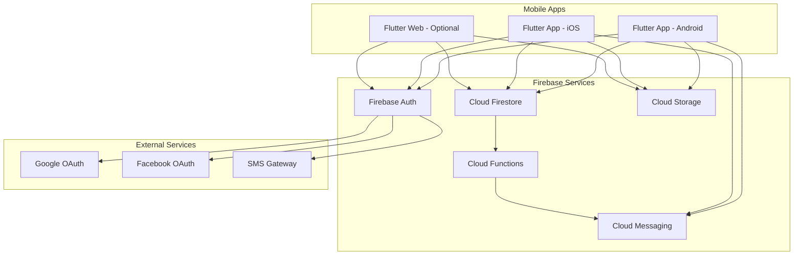

# CazLync Mobile App - Design Document

## Overview

CazLync is a Flutter-based mobile application that provides a marketplace for buying and selling cars in Zambia. The system uses Firebase as the backend-as-a-service platform, providing authentication, real-time database, cloud storage, and push notifications. The architecture follows a clean architecture pattern with clear separation between presentation, business logic, and data layers.

The application supports Android and iOS platforms with optional web deployment. The design emphasizes mobile-first user experience, offline capabilities, and real-time communication between buyers and sellers.

## Architecture

### High-Level Architecture



### Application Layer Architecture

The Flutter application follows clean architecture principles with three main layers:

**Presentation Layer**
- UI widgets and screens
- State management using Riverpod
- View models for business logic coordination
- Navigation and routing

**Domain Layer**
- Business entities and models
- Use cases for business operations
- Repository interfaces
- Business rules and validation

**Data Layer**
- Repository implementations
- Firebase service wrappers
- Local cache using Hive
- Data transfer objects (DTOs)

### State Management Strategy

Using Riverpod for state management with the following provider types:
- **StateNotifierProvider**: For complex state with business logic (auth, listings, chat)
- **FutureProvider**: For async data fetching
- **StreamProvider**: For real-time Firebase streams
- **Provider**: For dependency injection

## Components and Interfaces

### 1. Authentication Module

**Components:**
- `AuthService`: Handles Firebase Authentication operations
- `AuthRepository`: Interface for authentication operations
- `AuthController`: Manages authentication state
- `LoginScreen`, `RegisterScreen`, `PhoneVerificationScreen`: UI components

**Key Interfaces:**

```dart
abstract class AuthRepository {
  Future<User> signInWithEmail(String email, String password);
  Future<User> signUpWithEmail(String email, String password);
  Future<User> signInWithGoogle();
  Future<User> signInWithFacebook();
  Future<void> signInWithPhone(String phoneNumber);
  Future<User> verifyPhoneOTP(String verificationId, String otp);
  Future<void> signOut();
  Stream<User?> authStateChanges();
}
```

**Authentication Flow:**
1. User selects authentication method
2. AuthController calls appropriate AuthRepository method
3. Firebase Auth processes authentication
4. On success, user data is stored in Firestore
5. App navigates to home screen with authenticated session

### 2. Listing Management Module

**Components:**
- `ListingService`: Firestore operations for listings
- `ListingRepository`: Interface for listing CRUD operations
- `ListingController`: Manages listing state and business logic
- `HomeScreen`, `ListingDetailScreen`, `CreateListingScreen`: UI components
- `ImageUploadService`: Handles image compression and upload

**Key Interfaces:**

```dart
abstract class ListingRepository {
  Future<List<Listing>> getListings({ListingFilter? filter});
  Future<Listing> getListingById(String id);
  Future<String> createListing(Listing listing, List<File> images);
  Future<void> updateListing(String id, Listing listing);
  Future<void> deleteListing(String id);
  Stream<List<Listing>> watchListings({ListingFilter? filter});
  Future<void> toggleFavorite(String userId, String listingId);
  Future<List<Listing>> getFavorites(String userId);
}
```

**Listing Data Model:**

```dart
class Listing {
  final String id;
  final String sellerId;
  final String brand;
  final String model;
  final int year;
  final double price;
  final int mileage;
  final String description;
  final List<String> imageUrls;
  final ListingStatus status; // pending, active, rejected, deleted
  final bool isPremium;
  final DateTime createdAt;
  final DateTime? premiumExpiresAt;
  final Map<String, dynamic> specifications;
}
```

**Image Upload Process:**
1. User selects images (3-20 images)
2. Images are compressed using flutter_image_compress
3. Compressed images uploaded to Cloud Storage
4. Download URLs stored in Firestore listing document
5. Thumbnail versions generated via Cloud Functions

### 3. Search and Filter Module

**Components:**
- `SearchController`: Manages search and filter state
- `FilterService`: Applies filter logic
- `SearchScreen`, `FilterBottomSheet`: UI components

**Filter Criteria:**
- Brand (dropdown selection)
- Model (dropdown based on brand)
- Price range (min/max sliders)
- Year range (min/max)
- Mileage range (min/max)
- Location (future enhancement)

**Search Implementation:**
- Text search uses Firestore array-contains queries on indexed fields
- Filters applied client-side after initial query for flexibility
- Results cached locally for offline access

### 4. Chat Module

**Components:**
- `ChatService`: Firestore operations for messages
- `ChatRepository`: Interface for chat operations
- `ChatController`: Manages chat state
- `ChatListScreen`, `ChatRoomScreen`: UI components

**Key Interfaces:**

```dart
abstract class ChatRepository {
  Future<ChatSession> createChatSession(String buyerId, String sellerId, String listingId);
  Future<void> sendMessage(String sessionId, Message message);
  Stream<List<Message>> watchMessages(String sessionId);
  Stream<List<ChatSession>> watchChatSessions(String userId);
  Future<void> markAsRead(String sessionId, String userId);
}
```

**Chat Data Model:**

```dart
class ChatSession {
  final String id;
  final String buyerId;
  final String sellerId;
  final String listingId;
  final String lastMessage;
  final DateTime lastMessageTime;
  final Map<String, int> unreadCount; // userId -> count
  final DateTime createdAt;
}

class Message {
  final String id;
  final String sessionId;
  final String senderId;
  final String text;
  final DateTime timestamp;
  final bool isRead;
}
```

**Real-time Chat Flow:**
1. Buyer taps contact button on listing
2. System creates or retrieves existing ChatSession
3. ChatRoomScreen subscribes to messages stream
4. User sends message → stored in Firestore
5. Firestore triggers Cloud Function
6. Cloud Function sends FCM notification to recipient
7. Recipient's app receives notification and updates UI

### 5. Notification Module

**Components:**
- `NotificationService`: FCM operations
- `NotificationRepository`: Interface for notification operations
- `NotificationController`: Manages notification state and preferences

**Notification Types:**
- New message received
- Listing approved/rejected
- New listing matching saved search
- Premium listing expiring soon
- Admin announcements

**Implementation:**
- FCM tokens stored in user document
- Cloud Functions trigger notifications based on Firestore events
- Local notification handling using flutter_local_notifications
- Deep linking to relevant content when notification tapped

### 6. User Profile Module

**Components:**
- `ProfileService`: Firestore operations for user data
- `ProfileRepository`: Interface for profile operations
- `ProfileController`: Manages profile state
- `ProfileScreen`, `EditProfileScreen`, `MyListingsScreen`: UI components

**User Data Model:**

```dart
class UserProfile {
  final String id;
  final String email;
  final String? phoneNumber;
  final String displayName;
  final String? photoUrl;
  final bool isVerified;
  final DateTime? verificationExpiresAt;
  final List<String> favoriteListings;
  final DateTime createdAt;
  final Map<String, dynamic> settings;
}
```

### 7. Admin Dashboard Module

**Components:**
- `AdminService`: Admin-specific Firestore operations
- `AdminRepository`: Interface for admin operations
- `AdminController`: Manages admin state
- `AdminDashboardScreen`, `ListingModerationScreen`, `AnalyticsScreen`: UI components

**Admin Operations:**
- Approve/reject pending listings
- View and respond to reports
- Remove inappropriate content
- View platform analytics
- Send push notifications to users
- Manage verified seller status

**Analytics Tracked:**
- Total users and new registrations
- Total listings and new listings
- Most viewed brands/models
- Chat sessions initiated
- Premium listing conversions

### 8. Payment Module (Future Enhancement)

**Components:**
- `PaymentService`: Payment gateway integration
- `PaymentRepository`: Interface for payment operations
- `PaymentController`: Manages payment state
- `PremiumListingScreen`, `VerificationPaymentScreen`: UI components

**Payment Integration Options:**
- Mobile money (MTN, Airtel)
- Card payments via Flutterwave or Paystack
- Payment verification via webhooks

## Data Models

### Firestore Collections Structure

```
users/
  {userId}/
    - email: string
    - displayName: string
    - phoneNumber: string
    - photoUrl: string
    - isVerified: boolean
    - verificationExpiresAt: timestamp
    - favoriteListings: array<string>
    - fcmTokens: array<string>
    - createdAt: timestamp
    - settings: map

listings/
  {listingId}/
    - sellerId: string
    - brand: string
    - model: string
    - year: number
    - price: number
    - mileage: number
    - description: string
    - imageUrls: array<string>
    - status: string (pending|active|rejected|deleted)
    - isPremium: boolean
    - premiumExpiresAt: timestamp
    - specifications: map
    - viewCount: number
    - createdAt: timestamp
    - updatedAt: timestamp

chatSessions/
  {sessionId}/
    - buyerId: string
    - sellerId: string
    - listingId: string
    - lastMessage: string
    - lastMessageTime: timestamp
    - unreadCount: map<string, number>
    - createdAt: timestamp
    
    messages/
      {messageId}/
        - senderId: string
        - text: string
        - timestamp: timestamp
        - isRead: boolean

reports/
  {reportId}/
    - reporterId: string
    - listingId: string
    - reason: string
    - description: string
    - status: string (pending|reviewed|resolved)
    - createdAt: timestamp

analytics/
  daily/
    {date}/
      - newUsers: number
      - newListings: number
      - chatSessions: number
      - activeUsers: number
```

### Firestore Security Rules

Key security principles:
- Users can only read/write their own profile data
- Users can create listings but only modify their own
- Only admins can change listing status
- Chat participants can only access their own chat sessions
- All writes require authentication

### Cloud Storage Structure

```
listings/
  {listingId}/
    original/
      image1.jpg
      image2.jpg
    thumbnails/
      image1_thumb.jpg
      image2_thumb.jpg

users/
  {userId}/
    profile.jpg
    verification/
      document1.jpg
      document2.jpg
```

## Error Handling

### Error Categories

**Network Errors:**
- No internet connection
- Timeout errors
- Server unavailable

**Authentication Errors:**
- Invalid credentials
- Account already exists
- Email not verified
- Phone verification failed

**Validation Errors:**
- Missing required fields
- Invalid data format
- Image size/count limits exceeded

**Permission Errors:**
- Insufficient permissions
- Account suspended
- Feature not available

### Error Handling Strategy

1. **User-Friendly Messages**: Convert technical errors to readable messages
2. **Retry Logic**: Automatic retry for transient network errors (max 3 attempts)
3. **Offline Mode**: Cache data locally and sync when connection restored
4. **Error Logging**: Log errors to Firebase Crashlytics for monitoring
5. **Graceful Degradation**: Show cached data when real-time data unavailable

### Error UI Patterns

- Snackbar for minor errors (form validation)
- Dialog for critical errors (authentication failure)
- Empty state screens for no data scenarios
- Retry buttons for failed operations
- Offline indicator banner

## Testing Strategy

### Unit Testing

**Target Coverage: 80%+**

Test categories:
- Business logic in controllers and use cases
- Data models and serialization
- Repository implementations with mocked Firebase
- Validation functions
- Utility functions

Tools:
- `flutter_test` package
- `mockito` for mocking dependencies
- `fake_cloud_firestore` for Firestore mocking

### Widget Testing

**Target Coverage: Key user flows**

Test scenarios:
- Authentication flows (login, register, phone verification)
- Listing creation and editing
- Search and filter interactions
- Chat message sending and receiving
- Profile management

Tools:
- `flutter_test` for widget testing
- `golden_toolkit` for visual regression testing

### Integration Testing

**Target: Critical user journeys**

Test scenarios:
- Complete user registration to listing creation flow
- Browse listings to chat initiation flow
- Admin approval workflow
- Payment flow (when implemented)

Tools:
- `integration_test` package
- Firebase Emulator Suite for local testing

### Performance Testing

Metrics to monitor:
- App startup time (target: < 3 seconds)
- Listing load time (target: < 2 seconds)
- Image load time (target: < 1 second per image)
- Chat message delivery (target: < 2 seconds)
- Memory usage (target: < 200MB)

Tools:
- Flutter DevTools
- Firebase Performance Monitoring

### Security Testing

Test areas:
- Authentication bypass attempts
- Unauthorized data access
- Input injection attacks
- File upload vulnerabilities
- API rate limiting

## Performance Optimization

### Image Optimization

- Compress images to < 500KB before upload
- Generate thumbnails (200x150) for list views
- Use progressive loading with placeholders
- Cache images locally using cached_network_image
- Lazy load images in scrollable lists

### Data Optimization

- Paginate listing results (20 items per page)
- Use Firestore query limits and cursors
- Cache frequently accessed data locally
- Implement pull-to-refresh for data updates
- Use Firestore offline persistence

### App Performance

- Code splitting and lazy loading
- Minimize widget rebuilds with const constructors
- Use ListView.builder for long lists
- Implement debouncing for search inputs
- Optimize build methods and avoid expensive operations

## UI/UX Design Specifications

### Color Palette

- Primary: #D32F2F (CazLync Red)
- Secondary: #212121 (Deep Charcoal)
- Accent: #FFD54F (Amber)
- Background: #F5F5F5
- Surface: #FFFFFF
- Error: #E53935
- Success: #4CAF50

### Typography

- Font Family: Poppins
- Titles: Poppins Bold (24sp, 20sp, 18sp)
- Body: Poppins Regular (16sp, 14sp)
- Buttons: Poppins SemiBold (16sp)
- Captions: Poppins Regular (12sp)

### Screen Layouts

**Home Screen:**
- App bar with logo and search icon
- Featured listings carousel
- Filter chips (brand, price, year)
- Listing grid (2 columns on mobile)
- Bottom navigation bar

**Listing Detail Screen:**
- Image gallery with page indicators
- Price and title
- Specifications grid
- Seller info card with verified badge
- Action buttons (favorite, chat, call)

**Chat Screen:**
- Message list with sender/receiver styling
- Input field with send button
- Listing preview card at top
- Timestamp grouping

**Profile Screen:**
- User info header with edit button
- Tab bar (My Listings, Favorites, Settings)
- Listing cards with status indicators

### Navigation Structure

```
Bottom Navigation:
- Home (listings feed)
- Search (with filters)
- Post (create listing)
- Chats (message list)
- Profile (user account)

Deep Links:
- /listing/{id} - Listing detail
- /chat/{sessionId} - Chat room
- /profile/{userId} - User profile
```

## Deployment Strategy

### Development Environment

- Firebase project: cazlync-dev
- Debug builds with development certificates
- Firebase Emulator Suite for local testing
- Hot reload for rapid development

### Staging Environment

- Firebase project: cazlync-staging
- TestFlight (iOS) and Internal Testing (Android)
- Beta tester group for QA
- Performance monitoring enabled

### Production Environment

- Firebase project: cazlync-prod
- App Store and Google Play releases
- Phased rollout (10% → 50% → 100%)
- Crash reporting and analytics enabled
- A/B testing for feature experiments

### CI/CD Pipeline

1. Code push to repository
2. Automated tests run (unit, widget)
3. Build Android and iOS apps
4. Deploy to staging environment
5. Manual QA approval
6. Deploy to production with phased rollout

Tools:
- GitHub Actions or Codemagic for CI/CD
- Fastlane for deployment automation
- Firebase App Distribution for beta testing

## Security Considerations

### Data Protection

- All API calls use HTTPS
- Sensitive data encrypted at rest
- User passwords hashed with bcrypt
- PII data access logged and monitored

### Authentication Security

- Multi-factor authentication for admin accounts
- Session timeout after 30 days
- Device verification for new logins
- Rate limiting on authentication attempts

### Content Security

- Image moderation before approval
- Profanity filter for listings and messages
- Report and block functionality
- Admin review queue for flagged content

### API Security

- Firebase Security Rules enforce access control
- Rate limiting on Cloud Functions
- Input validation and sanitization
- CORS configuration for web version
